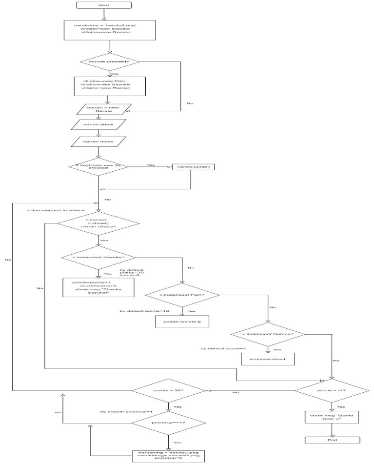

Al Imam Muhammad ibn Saud Islamic University College of Computer and Information System 

Computer Science Department 2nd  Semester 1443 H – 2022 G 

**CS 438 – Internet Technologies Project** 

**[Naruto Evolution ]** 

**BY:** 

|**STUDENT NAME**|**ID** |
| - | - |
|Jomana Saleh Alabdaly    |[439026715] |
|Reem Abdullah Alluhaidan |[439019731] |
|Salma Fhmed Fahmy |[439026713] |
|Shahad Mohammed Ben Dharaan |[439022654] |
**Supervisor:**

**Ms.Amal Algefes** 

`                                      `**Date:** 

**[8/5/2022]** 

In this project, First, the player will enter the login page, if he has an account, he will type the username and password, if he does not have an account, he will go to the sign-up page. 

In the game we have the main character Naruto and we have two values which are score and points. Naruto will run towards the front, and in front of him will be the characters Sasuke, Pain and Ramen food. Naruto must not collide with the character pain, when he collides with him, his points will decrease. Conversely, when Naruto collides with Sasuke and the food Ramen, it will increase the points and score. When the points reach 50, Naruto and Sasuke characters will transform and evolve, and this will be the Evolution of Naruto. This game is designed for anyone who enjoys playing games and loves Naruto. 

1. **Flow Chart   **
2. **Look & Feel :** 

**- Signup page**  

The background image of the page is character of our game [1]. The text is bold, color code #8B8000 and  font-family Papyrus, fantasy. There is a signup form inside a box at the center vertically and horizontally to the left of the page with border-radius 25px and opacity 60%. Inside a box at the top and middle "Signup" title in green color, below the title, the input takes username and password from the user then "Signup" button which background color is green and text color is white and border is solid thin with radius 25px, then "Login" text link. 

**-Login page**  

The background image of the page is character of our game [2], and page text is bold color purple and font-family Papyrus, fantasy. There  is login form inside a box at the center vertically and horizontally to the right of the page with border-radius 25px and opacity 60%. Inside a box at the top and middle "Login" title in purple color, below the title, the input takes username and password from the user then "Login" button which background color is purple and text color is white and border is solid thin with radius 25px, then "Sign up" text link with blue color. 

**-Naruto Running Game page** 

The background code color of the page is #FFFFE0 and text is bold with font-family Papyrus, fantasy. At the top and middle of the page there is text massage in red color " Enjoy playing 'user name'!", below the text there is a " Pass Your Score" button which background color is green and text color is white and border is solid thin with radius 25px, below of the button there are two red text links "Winners" and "Logout". 

**-Winners page** 

The background image of the page is main character of our game [3] and page text is bold green color and  font-family Papyrus, fantasy. There are score form inside a box, box at the middle of the page with border-radius 25px and opacity 60%. Inside a box at the top and middle "Your Score: 'User Score' " title, below the title, there are the winning players and score in two columns table with red text color, below of the table there are two text links "Play Again" and "Logout". In general, we matched the texts colors and themes to with colors of the characters we chose. 

3. **Dynamic Components :** 

[index (naruto – pain -sasuke – ramen -wallpaper)] 

4. **Business Logic**  

We have five columns in Database.( id -user\_id - user\_name -password – date – Score). 

The id has type bigint, length 20, auto increment and Primary key, the user\_id have type bigint  and length 20 , the user\_id have type bigint  and length 20, the user\_name have type varchar and length 100 , the password have type varchar and length 100, the date have type timestamp and default value current timestamp and the Score have type int , length 11, accepts the value null and default value is Null. 

When the user registers, the registration HTML form saves the data and sends it via the post method, and then sends it via query SQL and saves it in Database. When the user logs in, the HTML form takes the entered value and compares it to the values stored in the database using query Select.  

To be able to update the database and save the new score of each player, an SQL query was used. We used the “Update” SQL query to change the score of each player. An UPDATE query is used to change an existing row or rows in the database. Then we used “set” to choose which column to change, the SET clause specifies the columns to update and the new values for the columns. Lastly “where” was used to choose which player’s score to change, The WHERE clause is used to filter records. It is used to extract only those records that fulfill a specified condition. This is the SQL query that was used: 

"UPDATE users SET score = '$score' WHERE user\_name = '$user\_id[user\_name]'"; 

` `**Code:** 

**Index.php:** 

<?php  session\_start(); 

`  `include("connection.php");   include("functions.php"); 

`  `$user\_id = check\_login($con); ?> 

<!DOCTYPE html> 

<html> 

<head> 

`  `<title>Naruto Running Game</title> 

`  `      

`  ` 

</head> <body> 

 

`  `<h2>Enjoy playing <?php echo $user\_id['user\_name'];    ?>!</h2> 

<form method="post" action="score.php" id="form"> <input type="hidden" id = "scores" name="scores" > 

<input id="button" type="submit" value="Pass Your Score">   

<a href="winners.php" >Winners</a> 

<form method="post" action="score.php" id="form" > 

<a href="logout.php">Logout</a> </form> 

 

`  ` 

`    ` 

`    ` 

`    ` 

`    ` </body> 

</html> 

**login.php:** 

<?php  session\_start(); 

include("connection.php"); include("functions.php"); 

`    `if($\_SERVER['REQUEST\_METHOD'] == "POST")     { 

`        `//something was posted 

`        `$user\_name = $\_POST['user\_name']; 

`        `$password = $\_POST['password']; 

`        `if(!empty($user\_name) && !empty($password) && !is\_numeric($user\_name)) 

`        `{ 

`            `//read from database 

`            `$query = "select \* from users where user\_name = '$user\_name' limit 1"; 

`            `$result = mysqli\_query($con, $query); 

`            `if($result) 

`            `{ 

`                `if($result && mysqli\_num\_rows($result) > 0)                 { 

$user\_data = mysqli\_fetch\_assoc($result); 

if($user\_data['password'] === $password) { 

`                        `$\_SESSION['user\_id'] = $user\_data['user\_id'];                         header("Location: index.php"); 

`                        `die; 

`                    `} 

`                `} 

} 

`            `echo "wrong username or password!";         }else 

`        `{ 

`            `echo "wrong username or password!";         } 

`    `} 

?> 

<!DOCTYPE html> 

<html> 

<head> 

`    `<title>Login</title> </head> 

<body> 

 

<h1>Naruto Evolution</h1> 
 

`        `<form method="post"> 

`            `
Login
 

`            `<label >User Name: <input id="text" type="text" name="user\_name"></label> 

   

`            `<label>Password: <input id="text" type="password" name="password"></label>   

<input id="button" type="submit" value="Login">   

`            `<a href="signup.php">Sign-Up</a>           </form> 

`    `
 </body> </html> 

**signup.php:** 

<?php  session\_start(); 

include("connection.php"); include("functions.php"); 

`    `if($\_SERVER['REQUEST\_METHOD'] == "POST")     { 

`        `//something was posted 

`        `$user\_name = $\_POST['user\_name']; 

`        `$password = $\_POST['password']; 

`        `if(!empty($user\_name) && !empty($password) && !is\_numeric($user\_name)) 

`        `{ 

`            `//save to database 

`            `$user\_id = random\_num(20); 

`            `$query = "insert into users (user\_id,user\_name,password) values ('$user\_id','$user\_name','$password')"; 

mysqli\_query($con, $query); 

`            `header("Location: login.php"); 

`            `die; 

`        `}else 

`        `{ 

`            `echo "Please enter some valid information!";         } 

`    `} 

?> 

**References:**

1. “Pinterest,” Pinterest. https://www.pinterest.com/pin/565905509409806502/feedback/ (accessed May 03, 2022). 
1. “4K wallpaper: Sasuke Naruto Shippuden Wallpaper Iphone.” https://izzesmile.blogspot.com/2020/06/sasuke-naruto-shippuden-wallpaper- iphone.html?m=1 (accessed May 03, 2022). 
1. “Naruto Minimalist by RainerDrakkar on DeviantArt.” https://www.deviantart.com/rainerdrakkar/art/Naruto-Minimalist-869410584 (accessed May 03, 2022). 
1. https://www.youtube.com/watch?v=WYufSGgaCZ8 
1. [https://codingstatus.com/display-data-in-html-table-using-php-mysql/ ](https://codingstatus.com/display-data-in-html-table-using-php-mysql/)
12
